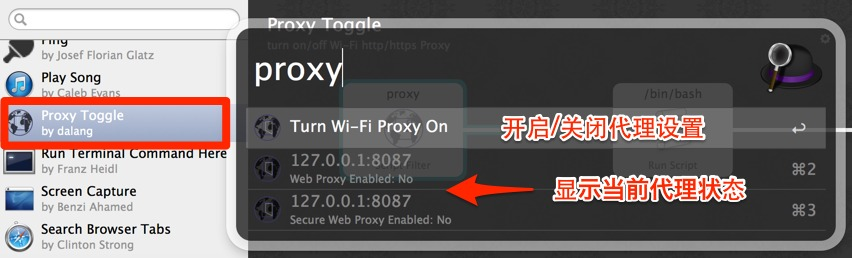
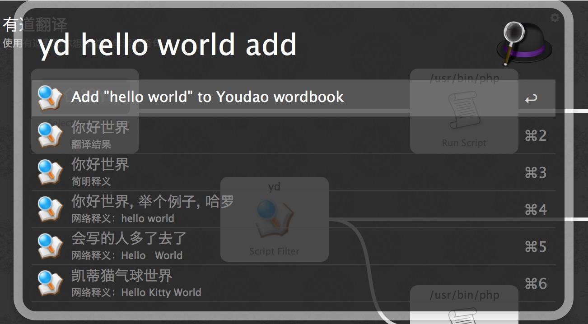

alfred-workflows
================
alfred workflows from [dalang](http://dalang.im)

### Proxy Toggle
是照着WiFi Toggle做的。用来关闭开启Mac下的系统http 和 https的Proxy设置，对于将GoAgent设为全局代理的人特别实用！

**因为使用networksetup设置Proxy需要sudo权限，所以使用了[Authenticate.app](http://www.dirtdon.com/Authenticate/)来保存用户名密码，第一次使用会提示输入用户密码。**

如果Authenticate的窗口未自动弹出，请手动点击workflow目录内的Authenticate.app。
你可以通过Alred Preferentces -> Workflow -> Proxy Toggle -> Show in Finder 进入workflow目录。

使用效果图如下

### 有道翻译 + wordbook
这个是在@icyleaf的[有道翻译workflow](http://www.alfredworkflow.com/#有道翻译)改的，有道翻译本身非常棒，我只是增加了把单词添加进生词本的功能。
由于需要记录网易通行证的帐号密码， **所以使用时你需要先修改其中的一个php脚本中的`$username` 和 `$password`的赋值。**
在单词后输入add 加回车可以添加进自己的生词本。

#### TODO
store account and password via Keychain

效果图如下

### ~~Farbox Sync~~
**deprecated** since farbox changing the sync mechanism
>之前在网上看到个“Farbox同步”的workflow，他通过在浏览器打开farbox的链接触发一次farbox同步。
觉得这种方式不够好，就改成用`curl`的方式触发。
**使用时需要把workflow中的bash脚本文件的`sync_url`变量赋值成自己对应的farbox同步链接。**
